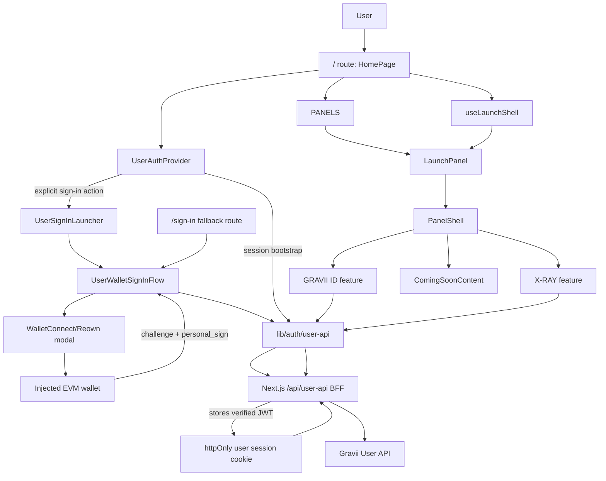

# Current Project Analysis

## Purpose

This document captures the current Launch App frontend state as of the live User API rollout.

It covers:

- the current application structure
- the runtime flow diagram
- the core file responsibility map
- the recommended refactor priorities
- how those priorities should connect to a future design system migration

This document describes the codebase as it exists now. Product intent and backend target architecture remain covered under `docs/launch-app/*`.

Related maintenance snapshot:

- [`code-audit-2026-05-28.md`](code-audit-2026-05-28.md) records the current unused-code, dependency, strictness, and cleanup findings that should guide future refactor work.

## Current Snapshot

The app is a single-route, client-driven Launch App shell with five product panels.

Current live-backed surfaces:

- `GRAVII ID`
- `X-RAY`

Current reserved surfaces:

- `DISCOVERY`
- `RANKING`
- hidden code-preserved `MY SPACE`

The current application should be understood as a hybrid of:

- live wallet sign-in
- live session validation
- live Gravii ID reads
- live X-Ray credits, lookup history, lookup runs, and detail reads
- X-Ray credit checkout entry that depends on backend-owned Stripe fulfillment
- reserved coming-soon product slots for surfaces whose backend contracts are not ready

## Runtime Structure Diagram

## Responsibility Map

### Route and App Boundary

`src/app/layout.tsx`

- Loads app-wide fonts.
- Wraps the application in `UserAuthProvider`.
- Keeps root layout responsibilities small.

`src/app/page.tsx`

- Owns the single Launch App route entry.
- Reads auth state.
- Creates the panel strip.
- Maps each `PanelId` to its feature content.
- Should remain an orchestration file, not a feature implementation file.

`src/app/sign-in/page.tsx`

- Provides the direct-link fallback route for external handoffs.
- Reuses the same wallet sign-in flow as the Launch App sign-in launcher.

`src/app/globals.css`

- Owns global reset, tokens, font variables, app-wide defaults, and shared keyframes.
- Should not become the home for feature-specific visual work.

### Auth and API Boundary

`src/features/auth/auth-provider.tsx`

- Owns client-side session bootstrap.
- Exposes `beginSignIn`, `cancelSignIn`, `completeSignIn`, `refreshSession`, `signOut`, and current auth state.
- Keeps anonymous users on the launch route and opens the wallet sign-in launcher only through explicit `beginSignIn` actions.

`src/features/auth/user-sign-in-launcher.tsx`

- Mounts the WalletConnect/Reown provider on demand from Launch App sign-in actions.
- Opens the wallet selector directly without an intermediate Gravii dialog.
- Keeps Escape cancellation available while the launcher is mounted.

`src/features/auth/user-sign-in-page.tsx`

- Owns the direct-link fallback page around the shared wallet sign-in flow.
- Restores an existing session before showing the fallback sign-in surface.
- Preserves referral codes from either the current query string or nested `next` URL.

`src/features/auth/user-wallet-sign-in-flow.tsx`

- Owns the shared WalletConnect/Reown and injected-wallet sign-in flow.
- Requests wallet accounts, an auth challenge, a personal signature, and User API verification.
- Lets the same-origin BFF store the verified JWT in an httpOnly cookie.
- Shows a small status overlay only during challenge, signing, verifying, or error states when launched from the main app.
- Preserves referral codes from either the current query string or nested `next` URL.

`src/lib/auth/user-api.ts`

- Owns User API request helpers.
- Normalizes backend snake_case payloads into frontend camelCase models.
- Uses the same-origin BFF in the browser and avoids exposing JWTs to browser JavaScript.
- Owns browser storage keys only for pending X-Ray wallet handoff and identity bootstrap flags.
- Should stay framework-light and avoid rendering concerns.

`src/app/api/user-api/[...path]/route.ts`

- Proxies browser calls to the configured Gravii User API.
- Reads the httpOnly session cookie and attaches backend `Authorization` headers server-side.
- Captures wallet verification tokens from backend responses, stores them in the httpOnly cookie, and strips them from browser-visible JSON.
- Clears the cookie on backend `401` responses.

`src/app/api/user-session/logout/route.ts`

- Clears the same-origin user session cookie during sign-out.

`src/lib/auth/server-user-session.ts`

- Owns server-only user session cookie options.
- Resolves the server-side Gravii User API base URL.

`next.config.ts`

- Configures Turbopack root for the shared frontend workspace.
- Defines app-wide security headers and preserves the legacy `/api/v1/*` development rewrite for compatibility.

### Launch Shell Boundary

`src/features/launch-app/panel-config.ts`

- Defines the ordered product panel metadata.
- Owns visible panel labels, editor copy, dark mode hints, and panel identifiers.

`src/features/launch-app/use-launch-shell.ts`

- Owns active and hovered panel state.
- Provides open, close, and hover handlers to the route shell.

`src/features/launch-app/types.ts`

- Defines panel IDs, panel config, shared content props, and reserved-surface domain types.

`src/components/layout/launch-panel`

- Owns collapsed and expanded panel behavior.
- Frames feature content in `PanelShell`.
- Provides keyboard access for opening panels.

`src/components/layout/panel-shell`

- Owns the shared expanded panel chrome.
- Provides the header, title, close action, body, and footer frame.

### Live Feature Boundaries

`src/features/profile/profile-content.tsx`

- Owns the `GRAVII ID` surface.
- Reads live identity data.
- Handles identity bootstrap polling for newly created wallets.
- Renders locked, loading, error, and connected profile states.
- Hands the current wallet into X-Ray through session storage before navigating to the X-Ray panel.

`src/features/profile/profile-view-model.ts`

- Maps `GraviiIdentity` into display-ready labels.
- Keeps number, currency, percent, persona, tier, and reputation formatting out of the component.

`src/features/profile/components/infinite-canvas`

- Owns the persona canvas effect.
- Should remain profile-specific unless the new design system makes canvas identity fields a reusable brand primitive.

`src/features/x-ray/x-ray-content.tsx`

- Owns the X-Ray feature flow.
- Reads credits and history.
- Validates EVM addresses with `viem`.
- Runs live lookups.
- Reads persisted X-Ray detail.
- Switches between search, loading, history, and result modes.

`src/features/x-ray/x-ray-view-model.ts`

- Maps tolerant backend X-Ray detail payloads into a stable UI view model.
- Owns X-Ray formatting, lookup date formatting, wallet label formatting, and pagination.

`src/features/x-ray/components/x-ray-history-list`

- Owns paginated history list rendering and selection callbacks.

`src/features/x-ray/components/x-ray-result-view`

- Owns the dense analytical result dashboard.
- Should be split only when new result sections or design system primitives make the split clearer.

### Reserved Feature Boundaries

`src/features/coming-soon/coming-soon-content.tsx`

- Provides the shared reserved-state treatment.
- Keeps the three parked surfaces explicit instead of silently showing stale mock content.

`src/features/standing/standing-content.tsx`

- Renders the visible Ranking surface.
- Shows public ranking context while gating the current wallet's rank behind sign-in.
- Does not currently own live ranking API reads.

`src/features/discovery/discovery-content.tsx`

- Renders the reserved Discovery surface.
- Keeps the surface structure visible behind a sign-in blur gate for anonymous users.
- Does not currently own live catalog, filtering, or eligibility logic.

`src/features/my-space/my-space-content.tsx`

- Preserves the hidden My Space surface implementation.
- Does not currently own live personalized benefits or opt-in logic.

### Shared UI Boundary

`src/components/ui/action-button`

- Shared panel/header button primitive.
- Handles click propagation defaults for panel chrome.

`src/components/ui/gravii-logo`

- Shared brand mark, wordmark, and motion mark primitive using `next/image`.

## Current Strengths

- The app is already TypeScript and TSX-only.
- The feature-first folder shape matches the product surface model.
- The route entry is mostly orchestration rather than feature logic.
- Live API normalization is centralized in one auth/API helper layer.
- Reserved surfaces are explicit, which is safer than shipping stale mock behavior.
- The existing tests cover panel opening/closing and the most important X-Ray flow.
- The visual language is distinctive enough to become the source for a stronger design system.

## Current Risks

- Some historical documentation still describes the older prototype state and should be read as rollout context.
- The auth boundary now protects the JWT with an httpOnly same-origin cookie, but individual product surfaces still need explicit session-required states until route-level access rules are introduced.
- Anonymous landing is intentional; individual live surfaces must keep their own session-required states until a route-level access boundary is introduced.
- `tsconfig.json` still allows implicit `any` through `noImplicitAny: false`.
- The panel system and visual components are not yet expressed as design system primitives.
- Tests now cover anonymous landing, explicit sign-in entry, and cross-app handoff; identity bootstrap retries and important failure modes still need broader coverage.

## Refactor Priorities

### P0: Stabilize The Current Live Rollout

Do these before large UI/UX changes.

- Keep codebase docs aligned with live auth/data behavior so developers do not follow the old mock-only mental model.
- Add test coverage for sign-in success, sign-in failure, and existing-session handoff behavior.
- Add test coverage for Profile identity loading, bootstrap retry, 401 refresh, and failure actions.
- Decide whether the rollout needs an explicit route access boundary beyond the current browser-side session handling.

### P1: Clean Up Reserved-Surface Debt

Do this before or during the first design system extraction.

- Add backend-backed adapters for `discovery`, hidden `my-space`, and `standing`/Ranking when contracts are ready.
- Split reserved-surface types out of `src/features/launch-app/types.ts` if they grow beyond shell concerns.
- Align README and feature READMEs with the final reserved-surface decision.

### P1: Prepare For Design System Migration

Do this before redesign implementation begins.

- Define design tokens in one documented layer before changing component visuals.
- Freeze names for color, typography, spacing, radius, elevation, motion, and z-index tokens.
- Identify primitives that should become stable shared components: button, panel, badge, field, metric, empty state, loading state, logo, and surface shell.
- Keep CSS Modules as the implementation default unless the project explicitly approves a styling migration.
- Avoid mixing a full visual redesign with auth/API refactors in the same change set.

### P2: Improve Feature Modularity

Do this after the live rollout and design system base are stable.

- Extract Profile subviews if the connected state continues to grow.
- Split X-Ray result sections when backend result detail becomes larger or more stable.
- Move feature-local API orchestration into feature-specific adapter files if the API surface expands.
- Consider React Query only if repeated caching, retries, invalidation, or background refresh become product requirements.

### P2: Increase Verification Depth

Do this as the app becomes more production-facing.

- Add integration tests for auth-gated navigation.
- Add tests for X-Ray invalid addresses, backend failures, empty history, and zero credits.
- Add visual or browser checks for panel interactions, responsive states, and motion-heavy components.
- Add accessibility checks for panel keyboard behavior, focus management, and status/error announcements.

## Recommended Next Work Sequence

1. Correct stale docs and publish this current-state analysis.
2. Create the design system plan and agree on token/component scope.
3. Add missing auth/Profile tests while behavior is still visually unchanged.
4. Clean up unused mock-era modules.
5. Introduce design tokens without changing every screen at once.
6. Rebuild shared shell and UI primitives on top of the tokens.
7. Redesign surfaces one by one, starting with the shell, then `GRAVII ID`, then `X-RAY`, then reserved surfaces.
