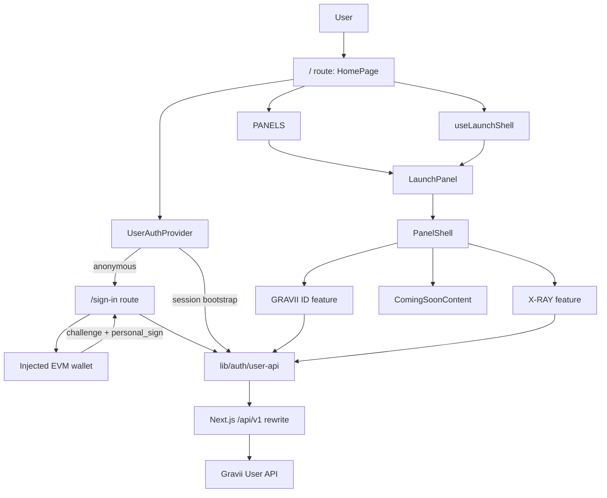

# Current Project Analysis

## Purpose

This document captures the current Launch App frontend state as of the live User API rollout.

It covers:

- the current application structure
- the runtime flow diagram
- the core file responsibility map
- the recommended refactor priorities
- how those priorities should connect to a future design system migration

This document describes the codebase as it exists now. Product intent and backend target architecture remain covered under `docs/launch-app/*`.

## Current Snapshot

The app is a single-route, client-driven Launch App shell with five product panels.

Current live-backed surfaces:

- `GRAVII ID`
- `X-RAY`

Current reserved surfaces:

- `STANDING`
- `DISCOVERY`
- `MY SPACE`

The current application should be understood as a hybrid of:

- live wallet sign-in
- live session validation
- live Gravii ID reads
- live X-Ray credits, lookup history, lookup runs, and detail reads
- reserved coming-soon product slots for surfaces whose backend contracts are not ready
- some stale mock-era files that are no longer part of the active runtime path

## Runtime Structure Diagram

## Responsibility Map

### Route and App Boundary

`src/app/layout.tsx`

- Loads app-wide fonts.
- Wraps the application in `UserAuthProvider`.
- Keeps root layout responsibilities small.

`src/app/page.tsx`

- Owns the single Launch App route entry.
- Reads auth state.
- Creates the panel strip.
- Maps each `PanelId` to its feature content.
- Should remain an orchestration file, not a feature implementation file.

`src/app/sign-in/page.tsx`

- Provides the sign-in route wrapper.
- Defers the actual sign-in flow to the auth feature.

`src/app/globals.css`

- Owns global reset, tokens, font variables, app-wide defaults, and shared keyframes.
- Should not become the home for feature-specific visual work.

### Auth and API Boundary

`src/features/auth/auth-provider.tsx`

- Owns client-side session bootstrap.
- Exposes `beginSignIn`, `refreshSession`, `signOut`, and current auth state.
- Keeps anonymous users on the launch route and enters the wallet sign-in flow only through explicit `beginSignIn` actions.

`src/features/auth/user-sign-in-page.tsx`

- Owns the injected wallet sign-in flow.
- Requests wallet accounts.
- Requests an auth challenge.
- Requests a personal signature.
- Verifies the wallet with the User API.
- Stores the returned JWT in browser storage.
- Preserves referral codes from either the current query string or nested `next` URL.

`src/lib/auth/user-api.ts`

- Owns User API request helpers.
- Normalizes backend snake_case payloads into frontend camelCase models.
- Owns browser storage keys for the JWT, pending X-Ray wallet handoff, and identity bootstrap flag.
- Should stay framework-light and avoid rendering concerns.

`next.config.mjs`

- Configures Turbopack root for the shared frontend workspace.
- Rewrites browser `/api/v1/*` calls to the configured User API base URL.

### Launch Shell Boundary

`src/features/launch-app/panel-config.ts`

- Defines the ordered product panel metadata.
- Owns visible panel labels, editor copy, dark mode hints, and panel identifiers.

`src/features/launch-app/use-launch-shell.ts`

- Owns active and hovered panel state.
- Provides open, close, and hover handlers to the route shell.

`src/features/launch-app/types.ts`

- Defines panel IDs, panel config, shared content props, and legacy campaign/leaderboard types.
- The legacy campaign and leaderboard types are candidates for cleanup once reserved surfaces no longer use mock-era modules.

`src/components/layout/launch-panel`

- Owns collapsed and expanded panel behavior.
- Frames feature content in `PanelShell`.
- Provides keyboard access for opening panels.

`src/components/layout/panel-shell`

- Owns the shared expanded panel chrome.
- Provides the header, title, close action, body, and footer frame.

`src/components/layout/my-space-dock`

- A legacy or alternate shell component for My Space.
- It is present in the repo, but the current route renders My Space through `LaunchPanel`.
- This should be reviewed before a design system migration so there is only one active panel primitive family.

### Live Feature Boundaries

`src/features/profile/profile-content.tsx`

- Owns the `GRAVII ID` surface.
- Reads live identity data.
- Handles identity bootstrap polling for newly created wallets.
- Renders locked, loading, error, and connected profile states.
- Hands the current wallet into X-Ray through session storage before navigating to the X-Ray panel.

`src/features/profile/profile-view-model.ts`

- Maps `GraviiIdentity` into display-ready labels.
- Keeps number, currency, percent, persona, tier, and reputation formatting out of the component.

`src/features/profile/components/infinite-canvas`

- Owns the persona canvas effect.
- Should remain profile-specific unless the new design system makes canvas identity fields a reusable brand primitive.

`src/features/x-ray/x-ray-content.tsx`

- Owns the X-Ray feature flow.
- Reads credits and history.
- Validates EVM addresses with `viem`.
- Runs live lookups.
- Reads persisted X-Ray detail.
- Switches between search, loading, history, and result modes.

`src/features/x-ray/x-ray-view-model.ts`

- Maps tolerant backend X-Ray detail payloads into a stable UI view model.
- Owns X-Ray formatting, lookup date formatting, wallet label formatting, and pagination.

`src/features/x-ray/components/x-ray-history-list`

- Owns paginated history list rendering and selection callbacks.

`src/features/x-ray/components/x-ray-result-view`

- Owns the dense analytical result dashboard.
- Should be split only when new result sections or design system primitives make the split clearer.

### Reserved Feature Boundaries

`src/features/coming-soon/coming-soon-content.tsx`

- Provides the shared reserved-state treatment.
- Keeps the three parked surfaces explicit instead of silently showing stale mock content.

`src/features/standing/standing-content.tsx`

- Renders the reserved Standing surface.
- Does not currently own live leaderboard logic.

`src/features/discovery/discovery-content.tsx`

- Renders the reserved Discovery surface.
- Does not currently own live catalog, filtering, or eligibility logic.

`src/features/my-space/my-space-content.tsx`

- Renders the reserved My Space surface.
- Does not currently own live personalized benefits or opt-in logic.

### Shared UI Boundary

`src/components/ui/action-button`

- Shared panel/header button primitive.
- Handles click propagation defaults for panel chrome.

`src/components/ui/gravii-logo`

- Shared brand mark, wordmark, and motion mark primitive using `next/image`.

`src/components/ui/grain-overlay`

- Shared canvas texture effect.
- Should be revisited during design system work as either a brand primitive or a panel-only effect.

`src/components/ui/launch-primitives`

- Shared presentational primitives from the previous launch UI.
- Should be audited before the design system migration to decide what graduates into stable primitives.

## Current Strengths

- The app is already TypeScript and TSX-only.
- The feature-first folder shape matches the product surface model.
- The route entry is mostly orchestration rather than feature logic.
- Live API normalization is centralized in one auth/API helper layer.
- Reserved surfaces are explicit, which is safer than shipping stale mock behavior.
- The existing tests cover panel opening/closing and the most important X-Ray flow.
- The visual language is distinctive enough to become the source for a stronger design system.

## Current Risks

- Some documentation still describes the old mock-only prototype state.
- The auth boundary is mostly browser-side; there is no route-level access boundary yet.
- Anonymous landing is intentional; individual live surfaces must keep their own session-required states until a route-level access boundary is introduced.
- JWT persistence is localStorage-based, which should be reviewed before a broader production hardening pass.
- `tsconfig.json` still allows implicit `any` through `noImplicitAny: false`.
- Legacy mock-era files remain for Discovery, My Space, and Standing even though the active UI now uses coming-soon content.
- The panel system and visual components are not yet expressed as design system primitives.
- Tests do not yet cover sign-in, identity bootstrap retries, or important failure modes.

## Refactor Priorities

### P0: Stabilize The Current Live Rollout

Do these before large UI/UX changes.

- Update stale codebase docs so developers do not follow the old mock-only mental model.
- Add test coverage for sign-in success, sign-in failure, and existing-session handoff behavior.
- Add test coverage for Profile identity loading, bootstrap retry, 401 refresh, and failure actions.
- Decide whether the rollout needs an explicit route access boundary beyond the current browser-side session handling.
- Decide whether localStorage JWT persistence is acceptable for this rollout or should move behind a stronger session strategy.

### P1: Clean Up Mock-Era Surface Debt

Do this before or during the first design system extraction.

- Inventory unused mock-era modules under `discovery`, `my-space`, `standing`, and `launch-app`.
- Delete or park unused mock files only when no active imports or planned near-term QA flows depend on them.
- Split legacy types out of `src/features/launch-app/types.ts` so active shell types are not mixed with inactive campaign and leaderboard types.
- Decide whether `MySpaceDock` is still a future layout primitive or should be removed in favor of one unified panel system.
- Align README and feature READMEs with the final reserved-surface decision.

### P1: Prepare For Design System Migration

Do this before redesign implementation begins.

- Define design tokens in one documented layer before changing component visuals.
- Freeze names for color, typography, spacing, radius, elevation, motion, and z-index tokens.
- Identify primitives that should become stable shared components: button, panel, badge, field, metric, empty state, loading state, logo, and surface shell.
- Keep CSS Modules as the implementation default unless the project explicitly approves a styling migration.
- Avoid mixing a full visual redesign with auth/API refactors in the same change set.

### P2: Improve Feature Modularity

Do this after the live rollout and design system base are stable.

- Extract Profile subviews if the connected state continues to grow.
- Split X-Ray result sections when backend result detail becomes larger or more stable.
- Move feature-local API orchestration into feature-specific adapter files if the API surface expands.
- Consider React Query only if repeated caching, retries, invalidation, or background refresh become product requirements.

### P2: Increase Verification Depth

Do this as the app becomes more production-facing.

- Add integration tests for auth-gated navigation.
- Add tests for X-Ray invalid addresses, backend failures, empty history, and zero credits.
- Add visual or browser checks for panel interactions, responsive states, and motion-heavy components.
- Add accessibility checks for panel keyboard behavior, focus management, and status/error announcements.

## Recommended Next Work Sequence

1. Correct stale docs and publish this current-state analysis.
2. Create the design system plan and agree on token/component scope.
3. Add missing auth/Profile tests while behavior is still visually unchanged.
4. Clean up unused mock-era modules.
5. Introduce design tokens without changing every screen at once.
6. Rebuild shared shell and UI primitives on top of the tokens.
7. Redesign surfaces one by one, starting with the shell, then `GRAVII ID`, then `X-RAY`, then reserved surfaces.
